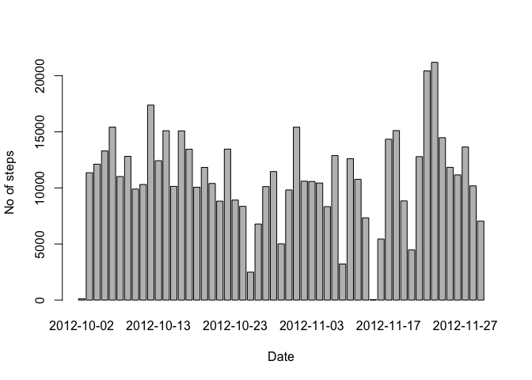
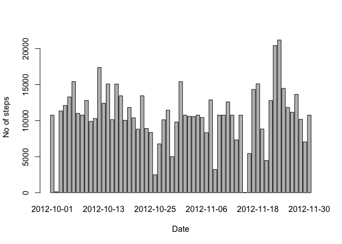

# Reproducible Research: Peer Assessment 1


## Loading and preprocessing the data
Data can be obtained from this repository. After downloading, it should be uncompressed and loaded into R (commands below assume teh working directory is set to the location of activity.zip file:

```r
  unzip("activity.zip")
  steps <- read.csv("activity.csv", stringsAsFactors=TRUE)
```

To get general idea of a quality of the data, we should run a summary against imported dataset:

```r
  summary(steps)
```

```
##      steps                date          interval     
##  Min.   :  0.00   2012-10-01:  288   Min.   :   0.0  
##  1st Qu.:  0.00   2012-10-02:  288   1st Qu.: 588.8  
##  Median :  0.00   2012-10-03:  288   Median :1177.5  
##  Mean   : 37.38   2012-10-04:  288   Mean   :1177.5  
##  3rd Qu.: 12.00   2012-10-05:  288   3rd Qu.:1766.2  
##  Max.   :806.00   2012-10-06:  288   Max.   :2355.0  
##  NA's   :2304     (Other)   :15840
```

There are 2304 missing values in the 'steps' colums.

## What is mean total number of steps taken per day?
In order to present the histogram of total number of steps taken per day the daily data has to be aggregated

```r
  stepsByDate <- aggregate(steps ~ date, data=steps, FUN=sum)
```

  With aggregated data the histogram can be created:

```r
  barplot(stepsByDate$steps, names.arg=stepsByDate$date, xlab="Date", ylab="No of steps")
```

 

Mean and median values of number of steps can ba calculated as follows:

```r
  mean(stepsByDate$steps)
```

```
## [1] 10766.19
```

```r
  median(stepsByDate$steps)
```

```
## [1] 10765
```

## What is the average daily activity pattern?
Average number of steps taken per interval averaged across all days can be calculated and plotted with:

```r
  stepsByInterval <- aggregate(steps ~ interval, data=steps, FUN=mean)
  plot(stepsByInterval, type="l")
```

 

To find out which interval contains the biggest number of steps, the followomg formula can be used:

```r
  stepsByInterval$interval[which.max(stepsByInterval$steps)]
```

```
## [1] 835
```

## Imputing missing values
From running summary command earlied we know that there are 2304 values missing in steps column, again:

```r
  summary(steps)
```

```
##      steps                date          interval     
##  Min.   :  0.00   2012-10-01:  288   Min.   :   0.0  
##  1st Qu.:  0.00   2012-10-02:  288   1st Qu.: 588.8  
##  Median :  0.00   2012-10-03:  288   Median :1177.5  
##  Mean   : 37.38   2012-10-04:  288   Mean   :1177.5  
##  3rd Qu.: 12.00   2012-10-05:  288   3rd Qu.:1766.2  
##  Max.   :806.00   2012-10-06:  288   Max.   :2355.0  
##  NA's   :2304     (Other)   :15840
```

```r
  sum(is.na(steps))
```

```
## [1] 2304
```

To fill in the missing values the mean value of a given period will be used. Those values were calculated before and are stored in stepsByInterval. As intervals are ordered in incrementing order and there is an integer number of them in dataset (61), we can add mean column to the data frame using cbind as shorter vector will be recycled. Then we fix the name of the added column

```r
  stepsFix<-cbind(steps, stepsByInterval$steps)
  names(stepsFix)[names(stepsFix) == "stepsByInterval$steps"] <- "meanSteps"
```

Now, using ifelse we can quickly fill in missing data

```r
  stepsFix$steps <- ifelse(is.na(stepsFix$steps), stepsFix$meanSteps, stepsFix$steps)
```

Resulting data frame does not contain NAs in steps column

```r
  summary(stepsFix)
```

```
##      steps                date          interval        meanSteps      
##  Min.   :  0.00   2012-10-01:  288   Min.   :   0.0   Min.   :  0.000  
##  1st Qu.:  0.00   2012-10-02:  288   1st Qu.: 588.8   1st Qu.:  2.486  
##  Median :  0.00   2012-10-03:  288   Median :1177.5   Median : 34.113  
##  Mean   : 37.38   2012-10-04:  288   Mean   :1177.5   Mean   : 37.383  
##  3rd Qu.: 27.00   2012-10-05:  288   3rd Qu.:1766.2   3rd Qu.: 52.835  
##  Max.   :806.00   2012-10-06:  288   Max.   :2355.0   Max.   :206.170  
##                   (Other)   :15840
```

In order to present the histogram of total number of steps taken per day the daily data has to be aggregated:

```r
  stepsByDateFix <- aggregate(steps ~ date, data=stepsFix, FUN=sum)
```
  With aggregated data the histogram can be created:

```r
  barplot(stepsByDateFix$steps, names.arg=stepsByDateFix$date, xlab="Date", ylab="No of steps")
```

 

Mean and median values of number of steps can ba calculated as follows:

```r
  mean(stepsByDate$steps)
```

```
## [1] 10766.19
```

```r
  median(stepsByDate$steps)
```

```
## [1] 10765
```

## Are there differences in activity patterns between weekdays and weekends?
We can add weekday/weekend factor column to our data frame fairly easy:

```r
stepsFix$weekday <- ifelse(weekdays(as.POSIXlt(stepsFix$date)) %in% c("Saturday", "Sunday"), "weekend", "weekday")
```

To plot two graphs at the same time a panel plot will be used:

```r
  par(mfrow = c(2,1))
  for (type in c("weekday", "weekend")) {
    stepsByDay <- aggregate(steps ~ interval, data = stepsFix, subset = (stepsFix$weekday == type), FUN = mean )
    plot(stepsByDay, type = "l", main = type)
  }
```

 
